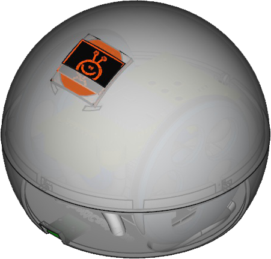

## Pi GAMESP Robot

## Catalog

- Model 3D FreeCAD (by [Xdesig][XDE01])

- GCode for Prusa i3 Hephestos

- STL for slicer

- Images mounting Process and connections

## Wheels

- Left wheel [wheel-l.stl](/rafacouto/3d-escornabot/brivoi-compactus/wheel-l.stl)

- Right wheel [wheel-r.stl](/rafacouto/3d-escornabot/brivoi-compactus/wheel-r.stl)

  - Original design by [Xoan Sampaiño][XOA01]. Wheels are modified by [RafaCouto](https://github.com/rafacouto/3d-models/tree/master/escornabot/stronger-wheel)

## License

Every content in this repo, otherwise specified under subdirectories, is
licensed under [Creative Commons BY-SA](LICENSE).

[XDE01]: https://twitter.com/xdesig
[XOA01]: https://github.com/xoan/escornabot